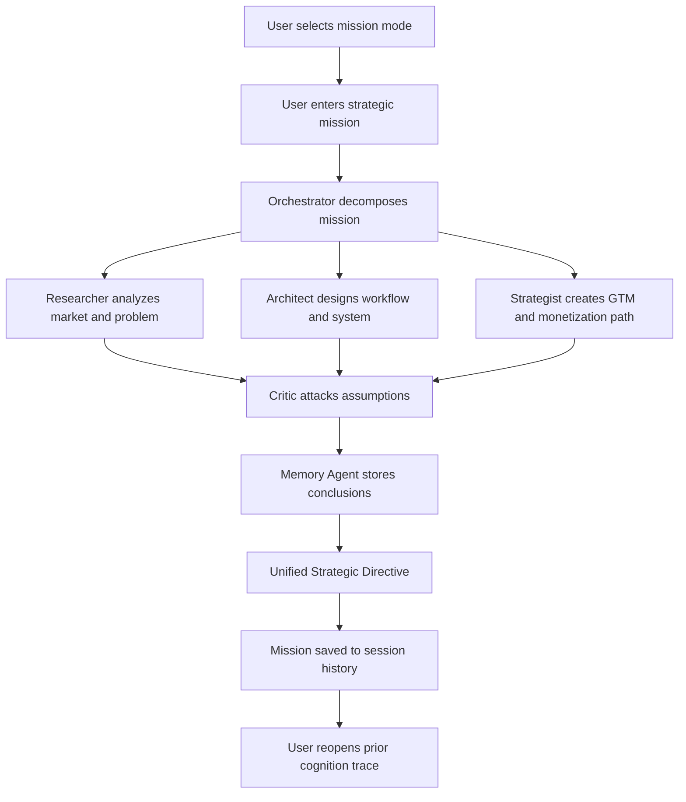

# NEXUS User Flow

## Golden Path

1. User opens NEXUS.
2. User selects `Strategic Planning`.
3. User enters: `Design an AI-native healthcare platform for reducing diagnostic errors.`
4. Agents activate and stream analysis.
5. Critic challenges the plan.
6. Knowledge graph expands.
7. NEXUS generates a strategic directive with risk levels and recommendations.
8. Mission is saved to history for later recall.
